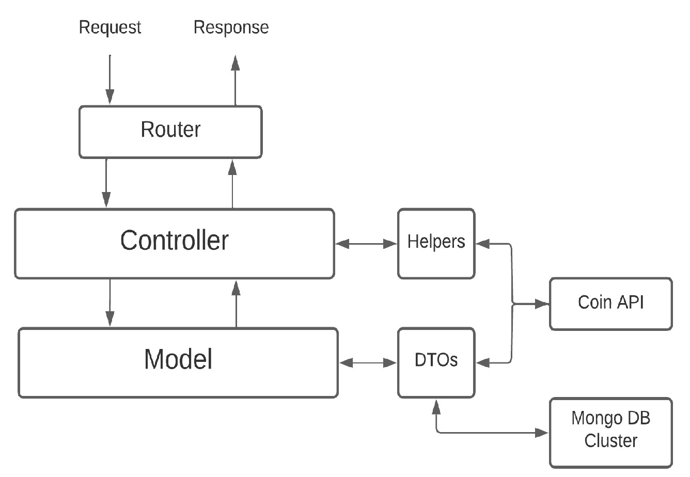

## Progetto-PDGT-Sessione-Estiva-Backend-21_22
Lato Backend del progetto d'esame per il corso di Piattaforme Digitali per la Gestione del Territorio 2021/2022

### Strudente
+ [Tommaso Petrelli](https://github.com/petrello)
+ Matricola: 305558

---

# Crypto App 🦎

### Descrizione e Obbiettivi
Il progetto ***Crypto App*** consiste in un servizio web utile per accedere in tempo reale ad informazioni relative ad una qualsiasi criptovaluta disponibile in almeno uno degli Exchange ad oggi esistenti (es: Binance, Crypto, ecc.).

Grazie a ***Crypto App*** un utente che farà utilizzo delle funzionalità del web server, attraverso un client appostio, potrà raggiungere i seguenti obbiettivi:
1. La possibilità di avere tutte le proprie criptovalute preferite in un unico posto
2. Avere accesso ad informazioni dettagliate
3. Poter accedere allo storico di una criptovaluta fino ad un anno da oggi
4. La possiblità di cambiare la valuta di conversione

Il client a disposizione dell'utente sarà un'applicazione cross-platform sviluppata utilizzando il framework Flutter. 
Applicazione client: [Crypto App Client](https://github.com/petrello/Progetto-PDGT-Sessione-Estiva-Frontend-21_22)

---

### Architettura e Scelte implementative
L'architettura per la costruzione del servizio si basa sul paradigma RESTful ed è strutturata in 2 livelli fondamentali: Controller e Model.

All'intenrno del **Controller** viene gestita tutta la logica dell'applicazione server. Tutti i metodi da esportare, i servizi e le scelte sulla gestione delle richieste e delle risposte vengono affrontate a questo livello. Possiamo dire che il livello Controller incorpori anche un livello di Service, e questo perché non si vuole scorporare in modo eccessivo l'applicazione. Infatti, ad interagire con il Controller è già presente un componente che abbiamo chiamato **Helpers** che esporterà i servizi necessari al Controller per soddisfare tutte le richieste. Questo livello dovrà anche comunicare il **Router** per saper riconoscere a quali Endpoints rispondere ed accedere alle richieste del client.

Il secondo livello fondamentale è il **Model**. A questo livello vogliamo comunicare con il Controller, verso l'alto, e con le collezioni del Cluster, verso il basso. Per quanto riguarda l'interazione verso l'alto, il Model vuole ben definire le entità del dominio di applicazione del servizio web per poi fornirle al Controller. Dall'altro lato, invece, vogliamo comunicare con il Cluster per accedere alle informazioni sia in lettura che in scrittura. Questo lo facciamo attraverso dei modelli costruti seguendo lo schema di Mongo DB. Inoltre, alcuni di questi modelli verranno trattati come  dei DTO (Data Trasnfer Object), ossia vogliamo utilizzarli come entità capaci di mappare il contenuto di una richiesta (ci aspettiamo un formato JSON) nel dominio di applicazione, e viceversa.

#### Tecnologie adottate
* **Node.js**: ambiente utilizzato per implementare il servizio web.
* **Express**: framework per applicazioni web seguito per progettare l'architettura dell'API.
* **Mongo DB Atlas**: piattaforma dati applicativi multi-cloud utilizzata per la memoriazzazione e la gestione dei dati.
* **Heroku**: piattaforma cloud PaaS (Platform as a Service) utilizzata per la messa online (deploy) del servizio web.
* **Flutter**: framework cross-platform utilizzato per costruire l'applicazione client.

#### Librerie utilizzate
Il gestore dei pacchetti utilizzato è **npm** (Node Package Manager).

* **node-fetch**: modulo che permette di utilizzare lato server Fetch API, cioè una interfaccia standard che mi permette di fare il fetching delle risorse attraverso la rete.
* **helmet**: è un middleware Express che aiuta a rendere un'applicazione web più sicura impostando diversi header HTTP.
* **body-parser**: è un middleware Node.js in grado di riconoscere il `body` di una richiesta ricevuta (`req.body`). Tra i parser a disposizione abbiamo soprattutto quello JSON.
* **cors**: pacchetto Node.js che fornisce un middleware da usare con Express per abilitare CORS (Cross-Origin Resource Sharing), ossia un meccanismo basatto sugli header HTTP che permette di stabilire da quali sorgenti accettare le richieste (in questo caso diciamo ad Express di accettare richieste da qualasiasi fonte).

---

### Dati e Servizi esterni utilizzati
... Coin API

---

### Documentazione API
...
vedi anche documentazione Coin API per codici e convenzioni da usare!!

---

### Messa online 
Il servizio web è disponibile al link: https://pdgt-crypto-app-api.herokuapp.com/

---

### Come si utilizza
... screnshot, test
