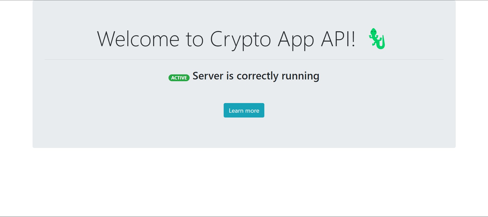

## Progetto-PDGT-Sessione-Estiva-Backend-21_22
Lato Backend del progetto d'esame per il corso di Piattaforme Digitali per la Gestione del Territorio 2021/2022

### Strudente
+ [Tommaso Petrelli](https://github.com/petrello)
+ Matricola: 305558

---

# Crypto App 🦎

### Descrizione e Obbiettivi
Il progetto ***Crypto App*** consiste in un servizio web utile per accedere in tempo reale ad informazioni relative ad una qualsiasi criptovaluta disponibile in almeno uno degli Exchange ad oggi esistenti (es: Binance, Crypto, ecc.).

Grazie a ***Crypto App*** un utente che farà utilizzo delle funzionalità del web server, attraverso un client appostio, potrà raggiungere i seguenti obbiettivi:
1. La possibilità di avere tutte le proprie criptovalute preferite in un unico posto
2. Avere accesso ad informazioni dettagliate
3. Poter accedere allo storico di una criptovaluta fino ad un anno da oggi
4. La possiblità di cambiare la valuta di conversione

Il client a disposizione dell'utente sarà un'applicazione cross-platform sviluppata utilizzando il framework Flutter. 
Applicazione client: [Crypto App Client](https://github.com/petrello/Progetto-PDGT-Sessione-Estiva-Frontend-21_22)

---

### Architettura e Scelte implementative
L'architettura per la costruzione del servizio si basa sul paradigma RESTful ed è strutturata in 2 livelli fondamentali: Controller e Model.

<div align="center"><a></a></div>

All'intenrno del **Controller** viene gestita tutta la logica dell'applicazione server. Tutti i metodi da esportare, i servizi e le scelte sulla gestione delle richieste e delle risposte vengono affrontate a questo livello. Possiamo dire che il livello Controller incorpori anche un livello di Service, e questo perché non si vuole scorporare in modo eccessivo l'applicazione. Infatti, ad interagire con il Controller è già presente un componente che abbiamo chiamato **Helpers** che esporterà i servizi necessari al Controller per soddisfare tutte le richieste. Questo livello dovrà anche comunicare il **Router** per saper riconoscere a quali Endpoints rispondere ed accedere alle richieste del client.

Il secondo livello fondamentale è il **Model**. A questo livello vogliamo comunicare con il Controller, verso l'alto, e con le collezioni del Cluster, verso il basso. Per quanto riguarda l'interazione verso l'alto, il Model vuole ben definire le entità del dominio di applicazione del servizio web per poi fornirle al Controller. Dall'altro lato, invece, vogliamo comunicare con il Cluster per accedere alle informazioni sia in lettura che in scrittura. Questo lo facciamo attraverso dei modelli costruti seguendo lo schema di Mongo DB. Inoltre, alcuni di questi modelli verranno trattati come  dei DTO (Data Trasnfer Object), ossia vogliamo utilizzarli come entità capaci di mappare il contenuto di una richiesta (ci aspettiamo un formato JSON) nel dominio di applicazione, e viceversa.


#### Tecnologie adottate
* **Node.js**: ambiente utilizzato per implementare il servizio web.
* **Express**: framework per applicazioni web seguito per progettare l'architettura dell'API.
* **Mongo DB Atlas**: piattaforma dati applicativi multi-cloud utilizzata per la memoriazzazione e la gestione dei dati.
* **Heroku**: piattaforma cloud PaaS (Platform as a Service) utilizzata per la messa online (deploy) del servizio web.
* **Flutter**: framework cross-platform utilizzato per costruire l'applicazione client.

#### Librerie utilizzate
Il gestore dei pacchetti utilizzato è **npm** (Node Package Manager).

* **node-fetch**: modulo che permette di utilizzare lato server Fetch API, cioè una interfaccia standard che mi permette di fare il fetching delle risorse attraverso la rete.
* **helmet**: è un middleware Express che aiuta a rendere un'applicazione web più sicura impostando diversi header HTTP.
* **body-parser**: è un middleware Node.js in grado di riconoscere il `body` di una richiesta ricevuta (`req.body`). Tra i parser a disposizione abbiamo soprattutto quello JSON che possiamo utilizzare per ottenere un `JavaScript Object`.
* **cors**: pacchetto Node.js che fornisce un middleware da usare con Express per abilitare CORS (Cross-Origin Resource Sharing), ossia un meccanismo basatto sugli header HTTP che permette di stabilire da quali sorgenti accettare le richieste (in questo caso diciamo ad Express di accettare richieste da qualasiasi fonte).
* **mongoose**: è un pacchetto che mi consente di modellare gli oggetti in un modo orientato a Mongo DB Atlas (chiamati `document`). Fornisce anche dei meccanismi per lavorare con i documenti del Cluster, anche in modo asincrono.
* **dotenv**: permette di caricare nell'oggetto `process.env` le variabili di ambiente specificate in un file `.env` presente nella root dell'applicazione. Verrà utilizzato solo per lo sviluppo locale.

---

### Dati e Servizi esterni utilizzati
Proseguendo in questo paragrafo possiamo pensare di aggiungere all'architettura dell'applicazione un terzo livello: **[CoinAPI](https://www.coinapi.io/)**.  

Tutti i dati riguardanti le criptovalute li possiamo ricavare attraverso delle richieste GET mandate dal nostro server alla API di CoinAPI. In particolare, ci interessa ottenere una lista di tutti gli *Asset* disposibili, delle *Icon Asset* corrispondenti, degli *Exchangerate*, ed infine della *History* di ognuno di essi.

> Nota che chiameremo con il termine *Asset* le criptovalute.

Per rendere il più indipendente possibile l'applicazione web dal servizio di CoinAPI, tutti i dati ottenuti verranno memorizzati in Collection su Mongo DB Atlas. Il Client non interagirà mai direttamente con CoinAPI perché il server web è stato strutturato in maniera tale da porre un livello intermedio tra richiesta del Client, fetch dei dati dalle Collection o da CoinAPI, e risposta del server.  
A questo scopo utilizziamo i DTO di cui abbiamo parlato nei paragrafi precedenti. CoinAPI restituisce tutti i dati sotto il formato JSON, per cui, grazie a body-parser e ai DTO, possiamo mappare tutti i dati in formato JSON nel formato JavaScript Object (qui interviene body-parser) e poi ancora trasformarli nel mongoose schema (qui invervengono i DTO).

CoinAPI fornisce diverse interfacce di comunicazione ma capiamo che quella adatta all'applicazione è quella RESTful. Infatti, se vogliamo avere indipendenza dal servizio non possiamo aprire Socket per richiedere i dati in real-time.

#### Come rendere disponibili i dati aggiornati al Client? 
La soluzione adottata consiste nell'aggiornare i dati o popolare nuove Collection di dati ogni qual volta il servizio web viene richiesto da qualcuno, ossia quando registriamo almeno una connessione alle collezioni di Mongo DB Atlas. Quando il servizio web si attiva controllerà tutte le informazioni a disposizione sul Cluster di Atlas e deciderà se è necessario aggiungere o aggiornare gli Asset.

#### I dati saranno affidabili?  
Possiamo permetterci di avere alcuni dati mantenuti con periodi di aggiornamento non costanti nel tempo. Pensiamo ad un Asset come un'entità statica dotata di elementi idenificativi come il nome o l'icona, la data di creazione, oppure la valuta di conversione. Sono tutti aspetti di un Asset che possiamo considerare "stabili" nel tempo, o comunque variabili in un tempo aleatorio.

Il discorso però non vale in modo assoluto. Un Asset ha anche un aspetto particolarmente dinamico, pensiamo ad esempio all'andamento del prezzo. Saranno per casi come questo in cui non sarà possibile avere indipendenza dai serivizi di CoinAPI in quanto è ragionevole pensare che il Client voglia avere accesso agli utlimi dati storici, come i tassi di conversione, i prezzi, ecc. Il servizio web ha bisogno di metodi ausiliari che permetteranno di aggiornare ad ogni richiesta del Client i dati di cui abbiamo bisogno e fornirli aggiornati all'istante di ricezione della richiesta.

La logica che permette di avere un aggiornamento real-time dei dati è tutta contenuta nel componente che abbiamo chiamato **Helpers**.

---

### Documentazione API
L'API fornita dal servisio web si basa sul meccanismo RESTful aderendo quindi allo schema di comunicaizone Request-Response.

Tutte le operazioni CRUD verranno fatte sugli Asset che l'utente che usa il servizio mette nella sua lista dei preferiti. Non verranno toccate, se non per aggiorarle tramite CoinAPI, le Collection contenenti tutti gli Asset.  
Allora, ad esempio, quando diciamo "creare" si intende aggiungere un nuovo asset alla lista dei preferiti; quando diciamo "eliminare" si intende eliminare un asset dalla lista dei preferiti.

#### HTTP success
| Response Code | Messaggio | Significato |
| :-----------: | :-------: | :--------- |
| 200 | OK | La richiesta è stata evasa correttamente | 
| 201 | Created | La risorsa fornita nel body è stato creata |
| 204 | No Content | La collezione di risorse richieste esiste ma è vuota |

Esempi:
* Ho richiesto dei dettagli per l'Asset BTC (Bitcoin), li ho trovati e sono stati inviati al Client correttamente => 200 OK.
* Il Client vuole aggiungere l'Asset ETH (Ethereum) alla sua lista di cripto preferite, lo creo, lo salvo nel database, e ritorno al Client l'oggetto creato => 201 Created.
* Il Client accede alla schermata Home per vedere tutte le sue cripto ma la lista è vuota => 204 No Content.

#### HTTP errors
| Response Code | Messaggio | Significato |
| :-----------: | :-------: | :--------- |
| 400 | Bad Request | Errore generico dovuto ad un errore nella richiesta del client |
| 403 | Forbidden | La risorsa che si vuole creare è già presente nella lista |
| 404 | Not Found | La risorsa a cui si vuole accedere non esiste |
| 409 | Conflict | Qualcosa è andato storto durante la creazione della risorsa |
| 500 | Internal Server Error | Si è presentata una condizione anomala che non ha permesso al server di evadere la richiesta |

Esempi:
* Il Client invia una richiesta con un body non idoneo in quanto ha richiesto i dettagli di un asset chiamato '' (nome non specificato) => 400 Bad Request.
* Il Client richiede di creare BTC come nuovo asset ma esiste già tra i preferiti => 403 Forbidden.
* Il Client richiede informazioni sull'asset LTC (Litecoin), ma non è presente nella lista dei preferiti => 404 Not Found.
* Viene generata un'eccezzione durante la creazione di un asset => 409 Conflict.
* Viene generata un'eccezione durante l'eliminazione di un asset => 500 Internal Server Error.

#### HTTP headers
Tutte le richieste verranno evase fornendo il corpo della risposta in formato JSON. Inoltre, si richiede che il corpo della richiesta sia a sua volta codificato in JSON: `Accept: application/json`. Il `Content-Type` del corpo della richiesta sappiamo che sarà sempre in formato JSON perche questo ci viene garantito dall'utilizzo del middleware Express *body-parser* che interpreta ogni `body` come fosse JSON. 

#### Endpoints
* **/ (root)**  
Contattando questo endpoint possiamo verificare lo stato del server. Infatti, il server ci restituirà, se attivo, una pagina HTML con cui vuole segnalare ai Client che è in esecuzione ed è in grado di ricevere richieste.  

<div align="center"><a></a></div>

Di seguito potremmo consultare una lista di tutti gli endpoint funzionali che vanno a coprire gli obbiettivi descritti all'inizio di questa relazione.  
> **Nota** che ogni descrizione è accompagnata da un esempio in cui si vedono delle possibili coppie richiesta-risposta, ognuno realizzato e testato grazie all'utilizzo di *Postman*. 

* **/userList/assets**  

  * **GET**
  
    * **/**  
    Contattato questo endpoint è possibile ricevere la lista degli Asset che il Client ha salvato. Questo si traduce in una risposta da parte del server che conterrà tutti i Document (gli Asset) presenti nella Collection (`user_assets`) di Mongo DB Atlas dedicata.    
    
    Esempio:  
    
    **URI**: https://pdgt-crypto-app-api.herokuapp.com/userList/assets
 
    **RESPONSE**:
    ```JSON
    {
        "status": "OK",
        "data": [
            {
                "_id": "62b18a21aada65fac6a4c6d4",
                "asset_id": "LTC",
                "name": "Litecoin",
                "icon": "https://s3.eu-central-1.amazonaws.com/bbxt-static-icons/type-id/png_64/a201762f149941ef9b84e0742cd00e48.png",
                "percentage_change": -16.64,
                "price": 53.7761041866696,
                "exchange_currency": "USD",
                "period_id": "1HRS",
                "duration_id": "1DAY",
                "time_period_start": "2022-06-20T09:06:29.271Z",
                "time_period_end": "2022-06-21T09:06:29.272Z",
                "plot_rate": [
                    53.0006745, 52.272779, 52.000521446293654, 53.12407005048214, 52.727593469250166, 
                    51.985443003534044, 55.985443003534044, 51.985443003534044, 51.985443003534044, 
                    52.86193149919329, 56.998617198795486, 52.497587824287045, 52.70672862271305,
                    52.86084451576892, 57.64325974070709, 52.90980545875966, 52.90388352006449, 
                    53.0012664408337, 58.823011493092274, 54.11335279266179, 53.09453588054682, 
                    53.78694948468701
                ],
                "__v": 0
            },
            {
                "_id": "62b3807c9005b71fc332ef0a",
                "asset_id": "BTC",
                "name": "Bitcoin",
                "icon": "https://s3.eu-central-1.amazonaws.com/bbxt-static-icons/type-id/png_64/4caf2b16a0174e26a3482cea69c34cba.png",
                "percentage_change": -4.47,
                "price": 19954.7514355802,
                "exchange_currency": "USD",
                "period_id": "1HRS",
                "duration_id": "1DAY",
                "time_period_start": "2022-06-21T20:50:00.498Z",
                "time_period_end": "2022-06-22T20:50:00.501Z",
                "plot_rate": [
                    20875.537011712222, 20844.139169547834, 20961.43822591027, 20886.189341357,
                    20709.047134650824, 20576.764018207625, 20407.38197492969, 20460.19089387282,
                    20305.473688665686, 20429.963689406024, 20372.044988149777, 20109.556993902454,
                    20096.091317717837, 20225.285376352163, 20419.396379592126, 20411.138901919297,
                    20498.791912443605, 20353.70595819256, 20709.109825890377, 20661.523020776873,
                    20048.77988896868, 20283.746697829796, 20231.382212649165, 20185.62176261925,
                    20086.274815272795
                ],
                "__v": 0
            }
        ]
    }
    ```
    
    * **/:asset_id**     
    In questo caso possiamo ricevere nel corpo della risposta solamente l'Asset richiesto. Osserviamo come questa volta dobbiamo aggiungere il parametro `asset_id` per comunicare al server quale sia l'Asset che interessa al client. Di conseguenza, capiamo che ogni Asset sarà associato ad un ID (in realtà ne avrà due..) che individua in modo univoco la risorsa.   
    
    Esempio:  
    
    **URI**: https://pdgt-crypto-app-api.herokuapp.com/userList/assets/BTC
 
    **RESPONSE**:
    ```JSON
    {
        "status": "OK",
        "data": {
                "_id": "62b3807c9005b71fc332ef0a",
                "asset_id": "BTC",
                "name": "Bitcoin",
                "icon": "https://s3.eu-central-1.amazonaws.com/bbxt-static-icons/type-id/png_64/4caf2b16a0174e26a3482cea69c34cba.png",
                "percentage_change": -4.47,
                "price": 19954.7514355802,
                "exchange_currency": "USD",
                "period_id": "1HRS",
                "duration_id": "1DAY",
                "time_period_start": "2022-06-21T20:50:00.498Z",
                "time_period_end": "2022-06-22T20:50:00.501Z",
                "plot_rate": [
                    20875.537011712222, 20844.139169547834, 20961.43822591027, 20886.189341357,
                    20709.047134650824, 20576.764018207625, 20407.38197492969, 20460.19089387282,
                    20305.473688665686, 20429.963689406024, 20372.044988149777, 20109.556993902454,
                    20096.091317717837, 20225.285376352163, 20419.396379592126, 20411.138901919297,
                    20498.791912443605, 20353.70595819256, 20709.109825890377, 20661.523020776873,
                    20048.77988896868, 20283.746697829796, 20231.382212649165, 20185.62176261925,
                    20086.274815272795
                ],
                "__v": 0
          }
    }
    ```
    
  * **POST**
  
    * **/**  
    Inviando una richiesta a questo endpoint del server, stiamo dichiarando di voler aggiungere un nuovo Asset alla lista dei preferiti. Allora in questo caso il client dovrà fornire un `body` contenente l'Asset che si vuole creare. Dobbiamo considerare che la risorsa è reale (e non fittizia) per cui non vogliamo lasciare al all'utente la libertà di "inventarsi" un nuovo Asset. Quello che richiediamo nel corpo della richiesta allora è una qualsiasi informazione che mi permette di capire quale sia l'Asset richiesto dall'utente. Allora anche in questo caso accettiamo l'`asset_id`:   
    
        ``` JSON
        {
           "asset_id": "ETH"
        }
        ```
        
      Con questo valore possiamo cercare all'interno del nostro databse se l'Asset esiste, in caso affermativo raccogliere le informazioni, ed infine completare i campi del nuovo Asset con valori di default (ad esempio, lo storico verrà impostato di default a "1DAY").  
      
    Esempio:  
    
    **URI**: https://pdgt-crypto-app-api.herokuapp.com/userList/assets
    
    **BODY**:
    ``` JSON
    {
       "asset_id": "ETH"
    }
    ```
 
    **RESPONSE**:
    ```JSON
    {
        "status": "Created",
        "data": {
            "asset_id": "ETH",
            "name": "Ethereum",
            "icon": "https://s3.eu-central-1.amazonaws.com/bbxt-static-icons/type-id/png_64/604ae4533d9f4ad09a489905cce617c2.png",
            "percentage_change": -6.84,
            "price": 1055.39597150854,
            "exchange_currency": "USD",
            "period_id": "1HRS",
            "duration_id": "1DAY",
            "time_period_start": "2022-06-21T21:22:39.025Z",
            "time_period_end": "2022-06-22T21:22:39.025Z",
            "plot_rate": [
                1121.857624781495, 1129.0324842653577, 1137.1662403565163, 1125.1652020168244,
                1117.5736547125312, 1101.100823165162, 1102.2658014472393, 1088.4982277424328,
                1099.0410913463995, 1093.0366040028716, 1078.4749954790614, 1074.8935819081855,
                1080.774578300098, 1090.6568649885953, 1089.176051568309, 1096.8471084574303,
                1082.294978579304, 1111.126438508694, 1107.7430934934027, 1072.6883907538768,
                1076.9687253607797, 1080.1495010467713, 1079.646114985639, 1068.8049352583826,
                1047.0991292738815
            ],
            "_id": "62b38822460907ec430e081b",
            "__v": 0
        }
    }
    ```
    
  * **PUT**
  
    * **/exchangerate/:asset_id**   
    Sarà possibile ottenere la conversione del prezzo di ogni Asset in svariate valute. In particolare, sarà possibile conoscere il prezzo in termini di: Dollaro Statunitense 'USD', Euro 'EUR', Yen 'JPY', Sterlina Britannica 'GBP', Yuan 'CNY', Franco Svizzero 'CHF', Won Sudcoreano 'KRW', Rublo Russo 'RUB'. Per avere una risposta positiva dal server sono necessarie nel corpo della richiesta le seguenti informazioni:
    
      ``` JSON
      {
        /* finestra temporale in cui potremmo vedere l'andamento del prezzo */
        "duration_id": "1DAY",
        /* data di inizio della finestra */
        "time_period_end": "2022-06-09T14:29:29.490Z",
        /* data di fine della finestra (tipicamente la data odierna */
        "time_period_start": "2022-06-08T14:29:29.490Z",
        /* periodo di campionamento del prezzo (mostriamo il prezzo ogni ora) */
        "period_id": "1HRS",
        /* valuta di conversione */
        "exchange_currency": "EUR"
      }
      ```    
      
      Esempio:  
      
      **URI**: https://pdgt-crypto-app-api.herokuapp.com/userList/assets/exchangerate/BTC
    
      **BODY**:
      ``` JSON
      {
         "duration_id": "1DAY",
         "time_period_end": "2022-06-22T21:22:39.025Z",
         "time_period_start": "2022-06-21T21:22:39.025Z",
         "period_id": "1HRS",
         "exchange_currency": "EUR"
     }
      ```

      **RESPONSE**:
      ```JSON
      {
          "status": "OK",
          "data": {
              "_id": "62b3807c9005b71fc332ef0a",
              "asset_id": "BTC",
              "name": "Bitcoin",
              "icon": "https://s3.eu-central-1.amazonaws.com/bbxt-static-icons/type-id/png_64/4caf2b16a0174e26a3482cea69c34cba.png",
              "percentage_change": -4.64,
              "price": 18937.532042839655,
              "exchange_currency": "EUR",
              "period_id": "1HRS",
              "duration_id": "1DAY",
              "time_period_start": "2022-06-21T20:50:00.498Z",
              "time_period_end": "2022-06-22T20:50:00.501Z",
              "plot_rate": [
                  19757.47788582733, 19868.661825507366, 19797.335868584836, 19629.42856365007,
                  19504.041723419552, 19343.49002363004, 19393.545870969498, 19246.894491626244,
                  19364.894492327985, 19309.99524943107, 19061.19146341465, 19048.427789306006,
                  19170.88661265608, 19354.87808492145, 19347.051091866633, 19430.134514164554,
                  19292.612282646976, 19629.48798662595, 19638.364243681088, 19055.964156419235,
                  19279.2954071189, 19229.524011642585, 19186.029619446104, 19091.602333687668,
                  18860.038181628683
              ],
              "__v": 0
          }
      }
      ```
    
    * **/history/:asset_id**    
     Se l'utente decide di voler avere accesso ad uno storico del prezzo di un Asset più o meno ristretto, allora si deve contattare questo endpoint. Il server si aspetta la seguente coppia di dati:
    
      ``` JSON
      {
        "duration_id": "1HRS",
        "exchange_currency": "USD"
      }
      ```    
      
      La risposta del server, come nel caso precedente, sarà un intero oggetto Asset codificato nel formato JSON.
      
      Esempio:  
      
      **URI**: https://pdgt-crypto-app-api.herokuapp.com/userList/assets/history/BTC
    
      **BODY**:
      ``` JSON
      {
          "duration_id": "1HRS",
          "exchange_currency": "EUR"
      }
      ```

      **RESPONSE**:
      ```JSON
      {
          "status": "OK",
          "data": {
              "_id": "62b3807c9005b71fc332ef0a",
              "asset_id": "BTC",
              "name": "Bitcoin",
              "icon": "https://s3.eu-central-1.amazonaws.com/bbxt-static-icons/type-id/png_64/4caf2b16a0174e26a3482cea69c34cba.png",
              "percentage_change": 0.22,
              "price": 18980.606920324302,
              "exchange_currency": "EUR",
              "period_id": "2MIN",
              "duration_id": "1HRS",
              "time_period_start": "2022-06-22T20:56:56.755Z",
              "time_period_end": "2022-06-22T21:56:56.755Z",
              "plot_rate": [
                  18948.3115511777, 18908.808818522462, 18860.038181628683, 18895.48833002679,
                  18886.920854683172, 18921.453409688213, 18920.59530299151, 18926.929873392848,
                  18880.671119254912, 18913.09948827467, 18891.413908805345, 18868.745392364184,
                  18917.294111294246, 18944.07771254858, 18906.17766065199, 18880.125571675297,
                  18883.22683730775, 18915.109774855166, 18938.495232799378, 18891.701254771167,
                  18881.09746822267, 18887.00544874772, 18836.470205745194, 18862.989120870472,
                  18872.86732845515, 18918.37266078573, 18956.969675186185, 18950.739924638325,
                  18969.86321909599, 18991.72857515219, 18970.360716686697
              ],
              "__v": 0
          }
      }
      ```
      
  * **DELETE**
  
    * **/:asset_id**    
    
    Il client ha la possibilità di rimuovere un Asset presente nella lista dell'utente. Se vogliamo eliminare un Asset dobbiamo necessariamente specificare l'ID univoco che lo identifica. Si richiede che, come nel caso della POST, il codice `asset_id` venga passato tra i parametri della richiesta. Qual'ora la richiesta venga evasa correttamente, allora il server risponderà al client inviando nel in formato JSON l'oggetto Asset eliminato.
    
    Esempio:   
    
    **URI**: https://pdgt-crypto-app-api.herokuapp.com/userList/assets/history/BTC
    
    **BODY**:
    ``` JSON
    {
        "duration_id": "1HRS",
        "exchange_currency": "EUR"
    }
    ```

    **RESPONSE**:
    ```JSON
    {
        "status": "OK",
        "data": {
            "_id": "62b18a21aada65fac6a4c6d4",
            "asset_id": "LTC",
            "name": "Litecoin",
            "icon": "https://s3.eu-central-1.amazonaws.com/bbxt-static-icons/type-id/png_64/a201762f149941ef9b84e0742cd00e48.png",
            "percentage_change": -16.64,
            "price": 53.7761041866696,
            "exchange_currency": "USD",
            "period_id": "1HRS",
            "duration_id": "1DAY",
            "time_period_start": "2022-06-20T09:06:29.271Z",
            "time_period_end": "2022-06-21T09:06:29.272Z",
            "plot_rate": [
                53.0006745, 52.272779, 52.000521446293654, 53.12407005048214,
                52.727593469250166, 51.985443003534044, 51.985443003534044, 51.985443003534044,
                51.985443003534044, 52.86193149919329, 51.998617198795486, 52.497587824287045,
                52.70672862271305, 52.86084451576892, 52.64325974070709, 52.90980545875966,
                52.90388352006449, 53.0012664408337, 53.823011493092274, 54.11335279266179,
                53.09453588054682, 53.78694948468701
            ],
            "__v": 0
        }
    }
    ```

> ##### Principi di naming utilizzati
> * *URIs as resources as nouns*: “RESTful URIs should refer to a resource that is a thing (noun) instead of referring to an action (verb) because nouns have properties which verbs do not have – similar to resources have attributes.” – RESTfulAPI.net
> * *Pluralized resources*: “API design experts would suggest you pluralize all resources unless they are singleton resources.” – nordicapis.com


#### Convenzioni utilizzate

| DURATION_ID         | PERIOD_ID               |
| :-----------------: | :---------------------: |
| 1HRS -> 1 ora       | 2MIN -> ogni 2 minuti   |
| 1DAY -> 1 giorno    | 1HRS -> ogni ora        |
| 1WEK -> 1 settimana | 8HRS -> ogni 8 ore      |
| 1MTH -> 1 mese      | 1DAY -> ogni giorno     |
| 1YER -> 1 anno      | 10DAY -> ogni 10 giorni |

*Duration_id*: è la durata di tempo in cui campioniamo per un certo periodo i costi di un asset è il tempo compreso tra time_period_start e time_period_end.   
*Period_id*: è il periodo di campionamento.

---

### Deployment del servizio 
Il servizio web è disponibile al link: https://pdgt-crypto-app-api.herokuapp.com/

---

### Come si utilizza
screnshot, test, gif, video ...
